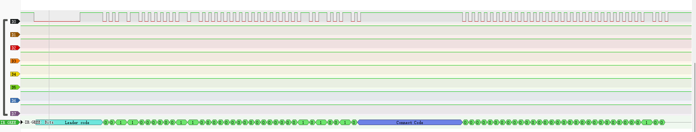

## sigrok Protocol decoder 格力（gree）空调遥控器 YAPOF

### 格力空调红外协议
遥控器型号为YAPOF

引导码 + 35位数据码 + 短连接码 + 32位数据码 + 长连接码 + 引导码 + 35位数据码 + 短连接码 + 32位数据码 + 结束码

空闲时为高电平

引导码：9ms低电平 + 4.5ms高电平

数据码 0：660us低电平+540us高电平

数据码 1：660us低电平+1680us高电平

短连接码：660us低电平+20000us高电平

长连接码：660us低电平+40000us高电平

结束码：660us低电平

## 使用ESP32 IDF RMT实现红外发射

载波：使用pwm产生的38KHz，占空比为0.33的方波。