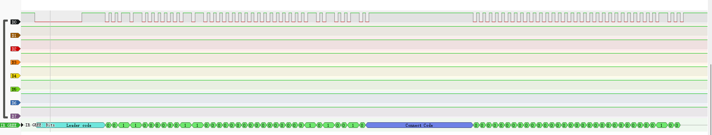

## sigrok Protocol decoder 格力（gree）空调遥控器 YAPOF

### 格力空调红外协议
遥控器型号为YAPOF

引导码（L）+35位数据码+连接码（C）+32位数据码 +结束码E

引导码“L”：9ms低电平+4.5ms高电平

连接码C：660us低电平+20000us高电平

逻辑“0”：660us低电平+540us高电平，

逻辑“1”：660us低电平+1680us高电平

